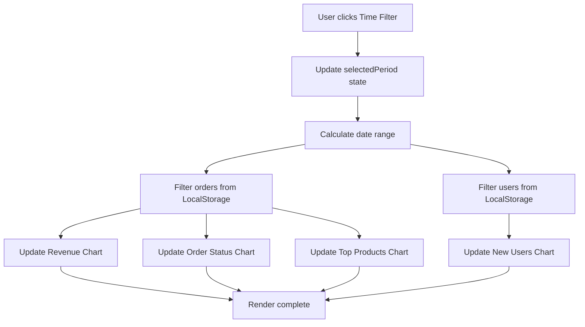

# Design Document: Dashboard Time Filter

## Overview

Tính năng Dashboard Time Filter cho phép admin lọc dữ liệu biểu đồ theo các khoảng thời gian khác nhau (tuần, tháng, năm). Thiết kế này tập trung vào việc tạo một UI component đơn giản, dễ sử dụng và đảm bảo tất cả biểu đồ được cập nhật đồng bộ khi thay đổi bộ lọc.

### Design Goals

- Tạo UI component time filter đơn giản, trực quan
- Đảm bảo tất cả biểu đồ cập nhật đồng bộ và mượt mà
- Tái sử dụng logic lọc dữ liệu cho tất cả biểu đồ
- Duy trì performance tốt với dữ liệu lớn
- Tương thích với codebase hiện tại (Chart.js, vanilla JavaScript)

## Architecture

### Component Structure

```
Dashboard Page
├── Time Filter Component (NEW)
│   ├── Filter Buttons (Week/Month/Year)
│   └── Active State Management
├── Statistics Cards (EXISTING)
└── Charts Section (MODIFIED)
    ├── Revenue Chart (Line)
    ├── Order Status Chart (Pie)
    ├── Top Products Chart (Bar)
    └── New Users Chart (Bar)
```

### Data Flow



### State Management

Sử dụng một biến global để quản lý trạng thái:

```javascript
let currentTimePeriod = 'week'; // 'week' | 'month' | 'year'
```

Không cần state management phức tạp vì:
- Chỉ có một state đơn giản (time period)
- Không có nested components
- Không cần persist state giữa các page loads

## Components and Interfaces

### 1. Time Filter Component

**HTML Structure:**

```html
<div class="time-filter">
    <button class="filter-btn active" data-period="week">
        Tuần (7 ngày)
    </button>
    <button class="filter-btn" data-period="month">
        Tháng (30 ngày)
    </button>
    <button class="filter-btn" data-period="year">
        Năm (12 tháng)
    </button>
</div>
```

**CSS Styling:**

```css
.time-filter {
    display: flex;
    gap: 12px;
    margin-bottom: 24px;
    flex-wrap: wrap;
}

.filter-btn {
    padding: 10px 20px;
    border: 2px solid #e5e7eb;
    background: white;
    border-radius: 8px;
    cursor: pointer;
    transition: all 0.2s;
}

.filter-btn:hover {
    border-color: #10b981;
}

.filter-btn.active {
    background: #10b981;
    color: white;
    border-color: #10b981;
}
```

**JavaScript Interface:**

```javascript
/**
 * Initialize time filter component
 */
function initTimeFilter() {
    const filterButtons = document.querySelectorAll('.filter-btn');
    filterButtons.forEach(btn => {
        btn.addEventListener('click', handleFilterChange);
    });
}

/**
 * Handle filter button click
 * @param {Event} event - Click event
 */
function handleFilterChange(event) {
    const period = event.target.dataset.period;
    updateTimePeriod(period);
}

/**
 * Update time period and refresh all charts
 * @param {string} period - 'week' | 'month' | 'year'
 */
function updateTimePeriod(period) {
    currentTimePeriod = period;
    
    // Update UI
    document.querySelectorAll('.filter-btn').forEach(btn => {
        btn.classList.remove('active');
    });
    event.target.classList.add('active');
    
    // Refresh all charts
    refreshAllCharts();
}
```

### 2. Date Range Calculator

**Interface:**

```javascript
/**
 * Calculate start date based on time period
 * @param {string} period - 'week' | 'month' | 'year'
 * @returns {Date} Start date for filtering
 */
function getStartDate(period) {
    const now = new Date();
    const startDate = new Date(now);
    
    switch(period) {
        case 'week':
            startDate.setDate(now.getDate() - 7);
            break;
        case 'month':
            startDate.setDate(now.getDate() - 30);
            break;
        case 'year':
            startDate.setDate(now.getDate() - 365);
            break;
    }
    
    startDate.setHours(0, 0, 0, 0);
    return startDate;
}

/**
 * Filter data by date range
 * @param {Array} data - Array of objects with createdAt property
 * @param {Date} startDate - Start date for filtering
 * @returns {Array} Filtered data
 */
function filterByDateRange(data, startDate) {
    return data.filter(item => {
        const itemDate = new Date(item.createdAt);
        return itemDate >= startDate;
    });
}
```

### 3. Chart Update Functions

**Revenue Chart:**

```javascript
/**
 * Update revenue chart based on current time period
 */
function updateRevenueChart() {
    const orders = JSON.parse(localStorage.getItem('orders')) || [];
    const startDate = getStartDate(currentTimePeriod);
    const filteredOrders = filterByDateRange(orders, startDate);
    
    let labels, data;
    
    if (currentTimePeriod === 'year') {
        // Group by month for year view
        ({ labels, data } = aggregateByMonth(filteredOrders));
    } else {
        // Group by day for week/month view
        ({ labels, data } = aggregateByDay(filteredOrders, currentTimePeriod));
    }
    
    // Destroy and recreate chart
    if (revenueChart) revenueChart.destroy();
    
    revenueChart = new Chart(ctx, {
        type: 'line',
        data: {
            labels: labels,
            datasets: [{
                label: 'Doanh thu (VNĐ)',
                data: data,
                borderColor: '#10b981',
                backgroundColor: 'rgba(16, 185, 129, 0.1)',
                tension: 0.4,
                fill: true
            }]
        },
        options: { /* same as before */ }
    });
}
```

**Order Status Chart:**

```javascript
/**
 * Update order status chart based on current time period
 */
function updateOrderStatusChart() {
    const orders = JSON.parse(localStorage.getItem('orders')) || [];
    const startDate = getStartDate(currentTimePeriod);
    const filteredOrders = filterByDateRange(orders, startDate);
    
    const statusCount = {
        'Đang xử lý': 0,
        'Đã xác nhận': 0,
        'Đang giao': 0,
        'Đã giao': 0,
        'Đã hủy': 0
    };
    
    filteredOrders.forEach(order => {
        if (statusCount[order.status] !== undefined) {
            statusCount[order.status]++;
        }
    });
    
    // Destroy and recreate chart
    if (orderStatusChart) orderStatusChart.destroy();
    
    orderStatusChart = new Chart(ctx, {
        type: 'doughnut',
        data: {
            labels: Object.keys(statusCount),
            datasets: [{
                data: Object.values(statusCount),
                backgroundColor: ['#fbbf24', '#3b82f6', '#6366f1', '#10b981', '#ef4444'],
                borderWidth: 2,
                borderColor: '#fff'
            }]
        },
        options: { /* same as before */ }
    });
}
```

**Top Products Chart:**

```javascript
/**
 * Update top products chart based on current time period
 */
function updateTopProductsChart() {
    const orders = JSON.parse(localStorage.getItem('orders')) || [];
    const startDate = getStartDate(currentTimePeriod);
    const filteredOrders = filterByDateRange(orders, startDate);
    
    // Count products from filtered orders
    const productCount = {};
    filteredOrders.forEach(order => {
        order.items.forEach(item => {
            productCount[item.name] = (productCount[item.name] || 0) + item.quantity;
        });
    });
    
    // Sort and get top 5
    const sortedProducts = Object.entries(productCount)
        .sort((a, b) => b[1] - a[1])
        .slice(0, 5);
    
    const labels = sortedProducts.map(p => p[0].substring(0, 20) + '...');
    const data = sortedProducts.map(p => p[1]);
    
    // Destroy and recreate chart
    if (topProductsChart) topProductsChart.destroy();
    
    topProductsChart = new Chart(ctx, {
        type: 'bar',
        data: {
            labels: labels,
            datasets: [{
                label: 'Đã bán',
                data: data,
                backgroundColor: '#10b981',
                borderRadius: 8
            }]
        },
        options: { /* same as before */ }
    });
}
```

**New Users Chart:**

```javascript
/**
 * Update new users chart based on current time period
 */
function updateNewUsersChart() {
    const users = JSON.parse(localStorage.getItem('users')) || [];
    const startDate = getStartDate(currentTimePeriod);
    const filteredUsers = filterByDateRange(users, startDate);
    
    let labels, data;
    
    if (currentTimePeriod === 'year') {
        // Group by month for year view
        ({ labels, data } = aggregateUsersByMonth(filteredUsers));
    } else {
        // Group by day for week/month view
        ({ labels, data } = aggregateUsersByDay(filteredUsers, currentTimePeriod));
    }
    
    // Destroy and recreate chart
    if (newUsersChart) newUsersChart.destroy();
    
    newUsersChart = new Chart(ctx, {
        type: 'bar',
        data: {
            labels: labels,
            datasets: [{
                label: 'Người dùng mới',
                data: data,
                backgroundColor: '#3b82f6',
                borderRadius: 8
            }]
        },
        options: { /* same as before */ }
    });
}
```

### 4. Data Aggregation Helpers

```javascript
/**
 * Aggregate orders by day
 * @param {Array} orders - Filtered orders
 * @param {string} period - 'week' or 'month'
 * @returns {Object} { labels: string[], data: number[] }
 */
function aggregateByDay(orders, period) {
    const days = period === 'week' ? 7 : 30;
    const labels = [];
    const data = [];
    
    for (let i = days - 1; i >= 0; i--) {
        const date = new Date();
        date.setDate(date.getDate() - i);
        const dateStr = date.toLocaleDateString('vi-VN', { 
            day: '2-digit', 
            month: '2-digit' 
        });
        labels.push(dateStr);
        
        const dayRevenue = orders
            .filter(order => {
                const orderDate = new Date(order.createdAt);
                return orderDate.toDateString() === date.toDateString() 
                    && order.status !== 'Đã hủy';
            })
            .reduce((sum, order) => sum + (order.total || 0), 0);
        
        data.push(dayRevenue);
    }
    
    return { labels, data };
}

/**
 * Aggregate orders by month
 * @param {Array} orders - Filtered orders
 * @returns {Object} { labels: string[], data: number[] }
 */
function aggregateByMonth(orders) {
    const labels = [];
    const data = [];
    
    for (let i = 11; i >= 0; i--) {
        const date = new Date();
        date.setMonth(date.getMonth() - i);
        const monthStr = date.toLocaleDateString('vi-VN', { 
            month: '2-digit', 
            year: 'numeric' 
        });
        labels.push(monthStr);
        
        const monthRevenue = orders
            .filter(order => {
                const orderDate = new Date(order.createdAt);
                return orderDate.getMonth() === date.getMonth() 
                    && orderDate.getFullYear() === date.getFullYear()
                    && order.status !== 'Đã hủy';
            })
            .reduce((sum, order) => sum + (order.total || 0), 0);
        
        data.push(monthRevenue);
    }
    
    return { labels, data };
}

/**
 * Aggregate users by day
 * @param {Array} users - Filtered users
 * @param {string} period - 'week' or 'month'
 * @returns {Object} { labels: string[], data: number[] }
 */
function aggregateUsersByDay(users, period) {
    const days = period === 'week' ? 7 : 30;
    const labels = [];
    const data = [];
    
    for (let i = days - 1; i >= 0; i--) {
        const date = new Date();
        date.setDate(date.getDate() - i);
        const dateStr = date.toLocaleDateString('vi-VN', { 
            day: '2-digit', 
            month: '2-digit' 
        });
        labels.push(dateStr);
        
        const dayUsers = users.filter(user => {
            const userDate = new Date(user.createdAt);
            return userDate.toDateString() === date.toDateString();
        }).length;
        
        data.push(dayUsers);
    }
    
    return { labels, data };
}

/**
 * Aggregate users by month
 * @param {Array} users - Filtered users
 * @returns {Object} { labels: string[], data: number[] }
 */
function aggregateUsersByMonth(users) {
    const labels = [];
    const data = [];
    
    for (let i = 11; i >= 0; i--) {
        const date = new Date();
        date.setMonth(date.getMonth() - i);
        const monthStr = date.toLocaleDateString('vi-VN', { 
            month: '2-digit', 
            year: 'numeric' 
        });
        labels.push(monthStr);
        
        const monthUsers = users.filter(user => {
            const userDate = new Date(user.createdAt);
            return userDate.getMonth() === date.getMonth() 
                && userDate.getFullYear() === date.getFullYear();
        }).length;
        
        data.push(monthUsers);
    }
    
    return { labels, data };
}
```

### 5. Main Refresh Function

```javascript
/**
 * Refresh all charts with current time period
 */
function refreshAllCharts() {
    updateRevenueChart();
    updateOrderStatusChart();
    updateTopProductsChart();
    updateNewUsersChart();
}
```

## Data Models

### Time Period Type

```typescript
type TimePeriod = 'week' | 'month' | 'year';
```

### Date Range

```typescript
interface DateRange {
    startDate: Date;
    endDate: Date;
}
```

### Aggregated Data

```typescript
interface AggregatedData {
    labels: string[];
    data: number[];
}
```

### Existing Data Models (from LocalStorage)

**Order:**
```typescript
interface Order {
    id: string;
    userId: string;
    items: OrderItem[];
    total: number;
    status: 'Đang xử lý' | 'Đã xác nhận' | 'Đang giao' | 'Đã giao' | 'Đã hủy';
    createdAt: string; // ISO date string
    updatedAt: string;
}

interface OrderItem {
    productId: string;
    name: string;
    price: number;
    quantity: number;
}
```

**User:**
```typescript
interface User {
    id: string;
    username: string;
    email: string;
    createdAt: string; // ISO date string
}
```

## Error Handling

### 1. Missing Data

```javascript
function filterByDateRange(data, startDate) {
    if (!data || !Array.isArray(data)) {
        console.warn('Invalid data provided to filterByDateRange');
        return [];
    }
    
    return data.filter(item => {
        if (!item.createdAt) {
            console.warn('Item missing createdAt:', item);
            return false;
        }
        
        const itemDate = new Date(item.createdAt);
        if (isNaN(itemDate.getTime())) {
            console.warn('Invalid date format:', item.createdAt);
            return false;
        }
        
        return itemDate >= startDate;
    });
}
```

### 2. Chart Initialization Errors

```javascript
function updateRevenueChart() {
    try {
        const ctx = document.getElementById('revenueChart');
        if (!ctx) {
            console.error('Revenue chart canvas not found');
            return;
        }
        
        // Chart creation logic...
        
    } catch (error) {
        console.error('Error updating revenue chart:', error);
        // Show user-friendly message
        showChartError('revenueChart', 'Không thể tải biểu đồ doanh thu');
    }
}

function showChartError(chartId, message) {
    const canvas = document.getElementById(chartId);
    if (canvas) {
        const parent = canvas.parentElement;
        parent.innerHTML = `
            <div class="chart-error">
                <p>⚠️ ${message}</p>
            </div>
        `;
    }
}
```

### 3. Performance Issues with Large Data

```javascript
function filterByDateRange(data, startDate) {
    // Early return for empty data
    if (!data || data.length === 0) return [];
    
    // Use efficient filtering
    const startTime = startDate.getTime();
    
    return data.filter(item => {
        const itemTime = new Date(item.createdAt).getTime();
        return itemTime >= startTime;
    });
}
```

### 4. Invalid Time Period

```javascript
function updateTimePeriod(period) {
    const validPeriods = ['week', 'month', 'year'];
    
    if (!validPeriods.includes(period)) {
        console.error('Invalid time period:', period);
        return;
    }
    
    currentTimePeriod = period;
    refreshAllCharts();
}
```

## Testing Strategy

### Unit Tests

Tính năng này là UI-heavy với DOM manipulation và Chart.js integration, nên sẽ sử dụng unit tests với mocking thay vì property-based testing.

**Test Categories:**

1. **Date Range Calculation Tests**
   - Test `getStartDate()` với các period khác nhau
   - Verify date calculations chính xác (7, 30, 365 ngày)
   - Test edge cases: chuyển tháng, chuyển năm, năm nhuận

2. **Data Filtering Tests**
   - Test `filterByDateRange()` với dữ liệu hợp lệ
   - Test với empty array
   - Test với missing createdAt
   - Test với invalid date format
   - Test với data ngoài range

3. **Data Aggregation Tests**
   - Test `aggregateByDay()` với week và month period
   - Test `aggregateByMonth()` với year period
   - Test với empty data (should return arrays of zeros)
   - Test với data có gaps (missing days/months)

4. **UI State Tests**
   - Test filter button active state changes
   - Test multiple clicks on same button
   - Test rapid clicking (debouncing if needed)

**Example Test Structure:**

```javascript
// Test suite for date range calculation
describe('getStartDate', () => {
    test('should return 7 days ago for week period', () => {
        const result = getStartDate('week');
        const expected = new Date();
        expected.setDate(expected.getDate() - 7);
        expected.setHours(0, 0, 0, 0);
        
        expect(result.toDateString()).toBe(expected.toDateString());
    });
    
    test('should return 30 days ago for month period', () => {
        const result = getStartDate('month');
        const expected = new Date();
        expected.setDate(expected.getDate() - 30);
        expected.setHours(0, 0, 0, 0);
        
        expect(result.toDateString()).toBe(expected.toDateString());
    });
    
    test('should return 365 days ago for year period', () => {
        const result = getStartDate('year');
        const expected = new Date();
        expected.setDate(expected.getDate() - 365);
        expected.setHours(0, 0, 0, 0);
        
        expect(result.toDateString()).toBe(expected.toDateString());
    });
});

// Test suite for data filtering
describe('filterByDateRange', () => {
    test('should filter data within date range', () => {
        const data = [
            { id: 1, createdAt: '2024-01-01T00:00:00Z' },
            { id: 2, createdAt: '2024-01-10T00:00:00Z' },
            { id: 3, createdAt: '2024-01-20T00:00:00Z' }
        ];
        const startDate = new Date('2024-01-05');
        
        const result = filterByDateRange(data, startDate);
        
        expect(result).toHaveLength(2);
        expect(result[0].id).toBe(2);
        expect(result[1].id).toBe(3);
    });
    
    test('should return empty array for null data', () => {
        const result = filterByDateRange(null, new Date());
        expect(result).toEqual([]);
    });
    
    test('should skip items with missing createdAt', () => {
        const data = [
            { id: 1, createdAt: '2024-01-10T00:00:00Z' },
            { id: 2 }, // missing createdAt
            { id: 3, createdAt: '2024-01-20T00:00:00Z' }
        ];
        const startDate = new Date('2024-01-01');
        
        const result = filterByDateRange(data, startDate);
        
        expect(result).toHaveLength(2);
        expect(result.find(item => item.id === 2)).toBeUndefined();
    });
});

// Test suite for data aggregation
describe('aggregateByDay', () => {
    test('should aggregate orders by day for week period', () => {
        const orders = [
            { total: 100000, status: 'Đã giao', createdAt: new Date().toISOString() },
            { total: 200000, status: 'Đã giao', createdAt: new Date().toISOString() }
        ];
        
        const result = aggregateByDay(orders, 'week');
        
        expect(result.labels).toHaveLength(7);
        expect(result.data).toHaveLength(7);
        expect(result.data[6]).toBe(300000); // Today's total
    });
    
    test('should return zeros for days with no data', () => {
        const orders = [];
        
        const result = aggregateByDay(orders, 'week');
        
        expect(result.labels).toHaveLength(7);
        expect(result.data).toEqual([0, 0, 0, 0, 0, 0, 0]);
    });
    
    test('should exclude cancelled orders', () => {
        const orders = [
            { total: 100000, status: 'Đã giao', createdAt: new Date().toISOString() },
            { total: 200000, status: 'Đã hủy', createdAt: new Date().toISOString() }
        ];
        
        const result = aggregateByDay(orders, 'week');
        
        expect(result.data[6]).toBe(100000); // Only non-cancelled
    });
});
```

### Integration Tests

1. **Full Filter Flow**
   - Click filter button → verify all 4 charts update
   - Verify chart data matches filtered data
   - Verify UI state (active button) updates correctly

2. **Chart.js Integration**
   - Verify charts destroy and recreate properly
   - Verify no memory leaks from chart instances
   - Verify chart options preserved after update

3. **LocalStorage Integration**
   - Test with real LocalStorage data
   - Test with missing LocalStorage keys
   - Test with corrupted data

### Manual Testing Checklist

- [ ] Filter buttons display correctly on desktop
- [ ] Filter buttons display correctly on mobile (responsive)
- [ ] Active state shows correctly when clicking buttons
- [ ] All 4 charts update when changing filter
- [ ] Charts show correct data for each time period
- [ ] Empty data shows zeros, not errors
- [ ] Performance is smooth with 1000+ orders
- [ ] No console errors when switching filters
- [ ] Chart tooltips still work after update
- [ ] Chart colors and styles preserved

### Performance Testing

- Measure time to update all charts with varying data sizes:
  - 100 orders: < 100ms
  - 1000 orders: < 300ms
  - 5000 orders: < 500ms

- Test rapid filter switching (click multiple times quickly)
- Monitor memory usage for chart destroy/recreate cycles

## Implementation Notes

### Integration with Existing Code

1. **Minimal Changes to Existing Functions**
   - Refactor existing chart init functions to accept filtered data
   - Keep existing chart configurations
   - Preserve existing color schemes and styles

2. **Backward Compatibility**
   - Default to 'week' period (current behavior)
   - Existing functionality works without filter interaction

3. **Code Organization**
   - Add new functions at top of script.js
   - Keep chart init functions in same location
   - Add helper functions in separate section

### Performance Optimizations

1. **Efficient Date Comparisons**
   - Convert dates to timestamps once
   - Use timestamp comparison instead of Date objects

2. **Chart Destruction**
   - Always destroy chart before recreating
   - Prevents memory leaks and canvas issues

3. **Data Caching** (Optional Enhancement)
   - Cache filtered data for each period
   - Invalidate cache when LocalStorage changes

### Accessibility

- Filter buttons keyboard accessible (tab navigation)
- Active state visible for keyboard users
- ARIA labels for screen readers:
  ```html
  <button class="filter-btn" 
          data-period="week"
          aria-label="Lọc dữ liệu theo tuần"
          aria-pressed="true">
      Tuần (7 ngày)
  </button>
  ```

### Browser Compatibility

- Tested on: Chrome, Firefox, Safari, Edge
- Uses standard JavaScript (ES6+)
- Chart.js v4.4.0 compatible
- LocalStorage API (widely supported)

## Future Enhancements

1. **Custom Date Range**
   - Add date picker for custom start/end dates
   - "So sánh với kỳ trước" feature

2. **Export Data**
   - Export filtered data to CSV/Excel
   - Export charts as images

3. **Real-time Updates**
   - Auto-refresh when LocalStorage changes
   - WebSocket integration for live data

4. **Advanced Filters**
   - Filter by order status
   - Filter by product category
   - Multiple filter combinations

5. **Performance**
   - Implement data caching
   - Lazy load charts (only render visible ones)
   - Virtual scrolling for large datasets
