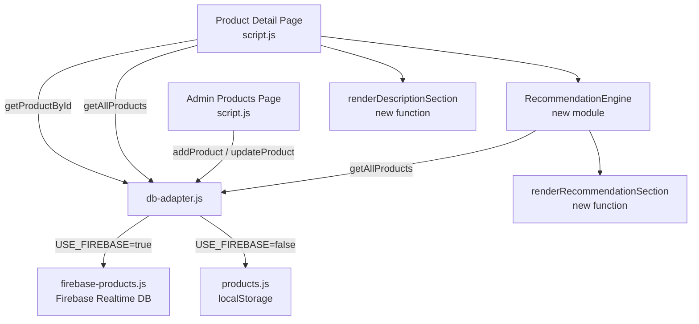

# Design Document

## Tính năng: Product Description & Recommendations

---

## Overview

Tính năng bổ sung hai phần quan trọng vào trang chi tiết sản phẩm (`pages/product-detail/`) của Fan Shop:

1. **Mô tả sản phẩm chi tiết** — hiển thị `description` dạng văn bản có định dạng và `specifications` dạng bảng key-value, thay thế đoạn placeholder hiện tại.
2. **Gợi ý sản phẩm liên quan** — một Recommendation Engine thuần JavaScript tính toán tối đa 4 sản phẩm gợi ý theo thứ tự ưu tiên: cùng category → cùng khoảng giá (±30%) → bán chạy nhất; kết quả được render thành một lưới Product Card bên dưới phần đánh giá.

Ngoài ra, trang admin quản lý sản phẩm được cập nhật để nhập/chỉnh sửa `description` (textarea + bộ đếm ký tự) và `category` (input/select).

Dự án không dùng framework — toàn bộ là Vanilla JS + HTML + CSS. Backend chính là Firebase Realtime Database với localStorage làm fallback, được trừu tượng hóa qua `db-adapter.js`.

---

## Architecture

### Luồng dữ liệu tổng thể



### Các module mới / thay đổi

| File | Thay đổi |
|---|---|
| `shared/js/products.js` | Thêm trường `description`, `category`, `specifications` vào schema; cập nhật `addProduct`, `updateProduct`, `initDefaultProducts` |
| `shared/js/firebase-products.js` | Cập nhật `firebaseAddProduct`, `firebaseUpdateProduct` để persist 3 trường mới; cập nhật `firebaseInitProducts` |
| `shared/js/db-adapter.js` | Cập nhật `addProductLocal`, `updateProductLocal` để xử lý 3 trường mới; thêm validation `description` ≤ 2000 ký tự |
| `shared/js/recommendation-engine.js` | **Mới** — module thuần JS chứa `getRecommendations(productId, allProducts)` |
| `pages/product-detail/script.js` | Thêm `renderDescriptionSection()`, tích hợp `RecommendationEngine`, thêm `renderRecommendationSection()` |
| `pages/product-detail/index.html` | Thêm `<section id="description-section">` và `<section id="recommendation-section">` |
| `pages/product-detail/style.css` | Thêm styles cho description section, specs table, recommendation grid, product card |
| `pages/admin/products/index.html` | Thêm textarea `description` + char counter, input/select `category` vào form |
| `pages/admin/products/script.js` | Cập nhật `showAddProductForm`, `editProduct`, `saveProduct` để xử lý 2 trường mới; thêm client-side validation |

---

## Components and Interfaces

### 1. Recommendation Engine (`shared/js/recommendation-engine.js`)

Module độc lập, không có side effects, dễ test.

```javascript
/**
 * Tính toán danh sách sản phẩm gợi ý.
 *
 * @param {string} currentProductId - ID sản phẩm hiện tại
 * @param {Product[]} allProducts   - Toàn bộ danh sách sản phẩm
 * @returns {Product[]}             - Tối đa 4 sản phẩm gợi ý (không chứa sản phẩm hiện tại)
 */
function getRecommendations(currentProductId, allProducts) { ... }

/**
 * Chuyển chuỗi `sold` ("1,2k", "10k+", "300") thành số nguyên để so sánh.
 * @param {string} soldStr
 * @returns {number}
 */
function parseSoldCount(soldStr) { ... }

/**
 * Kiểm tra xem giá của một sản phẩm có nằm trong khoảng ±30% của giá tham chiếu không.
 * @param {number} price
 * @param {number} referencePrice
 * @returns {boolean}
 */
function isInPriceRange(price, referencePrice) { ... }
```

**Thuật toán `getRecommendations`:**

```
1. Nếu allProducts.length < 2 → trả về []
2. candidates = allProducts.filter(p => p.id !== currentProductId)
3. current = allProducts.find(p => p.id === currentProductId)
4. result = []

5. // Ưu tiên 1: cùng category
   sameCategory = candidates.filter(p => p.category && p.category === current.category)
   result.push(...sameCategory.slice(0, 4))

6. // Ưu tiên 2: cùng khoảng giá (±30%), chưa có trong result
   if result.length < 4:
     priceRange = candidates
       .filter(p => !result.includes(p) && isInPriceRange(p.price, current.price))
     result.push(...priceRange.slice(0, 4 - result.length))

7. // Ưu tiên 3: bán chạy nhất, chưa có trong result
   if result.length < 4:
     bestsellers = candidates
       .filter(p => !result.includes(p))
       .sort((a, b) => parseSoldCount(b.sold) - parseSoldCount(a.sold))
     result.push(...bestsellers.slice(0, 4 - result.length))

8. return result.slice(0, 4)
```

### 2. Description Section (trong `pages/product-detail/script.js`)

```javascript
/**
 * Render phần mô tả sản phẩm vào container đã cho.
 * @param {Product} product
 * @returns {string} HTML string
 */
function renderDescriptionHTML(product) { ... }
```

- Nếu `description` không rỗng: render trong `<div class="description-text">`.
- Nếu `description` rỗng/null: render `<p class="description-empty">Chưa có mô tả cho sản phẩm này.</p>`.
- Nếu `specifications` không rỗng: render `<table class="specs-table">` với các hàng key-value.
- Nếu `specifications` rỗng/null: ẩn phần specs.

### 3. Recommendation Section (trong `pages/product-detail/script.js`)

```javascript
/**
 * Render phần gợi ý sản phẩm.
 * @param {Product[]} recommendations - Kết quả từ getRecommendations()
 * @returns {string} HTML string
 */
function renderRecommendationHTML(recommendations) { ... }

/**
 * Render một Product Card.
 * @param {Product} product
 * @returns {string} HTML string
 */
function renderProductCardHTML(product) { ... }
```

- Nếu `recommendations.length === 0`: trả về chuỗi rỗng (section bị ẩn).
- Mỗi card chứa: ``, tên, giá định dạng VND, badge (nếu có), link đến `?productId={id}`.

### 4. Admin Form Updates

Thêm vào form trong `pages/admin/products/index.html`:

```html
<!-- Danh mục -->
<div class="form-group">
  <label>Danh mục</label>
  <select id="product-category">
    <option value="">-- Chọn danh mục --</option>
    <option value="Quạt trần">Quạt trần</option>
    <option value="Quạt đứng">Quạt đứng</option>
    <option value="Quạt bàn">Quạt bàn</option>
    <option value="Quạt mini">Quạt mini</option>
    <option value="Quạt tích điện">Quạt tích điện</option>
    <option value="Quạt điều hòa">Quạt điều hòa</option>
    <option value="Quạt treo tường">Quạt treo tường</option>
    <option value="Quạt thông gió">Quạt thông gió</option>
    <option value="Quạt tháp">Quạt tháp</option>
  </select>
</div>

<!-- Mô tả -->
<div class="form-group">
  <label>Mô tả sản phẩm</label>
  <textarea id="product-description" maxlength="2000"
    placeholder="Nhập mô tả chi tiết sản phẩm (tối đa 2000 ký tự)"></textarea>
  <div class="char-count">
    <span id="description-char-count">0</span>/2000 ký tự
  </div>
</div>
```

---

## Data Models

### Product (schema mở rộng)

```javascript
{
  id: string,                    // Unique ID
  name: string,                  // Tên sản phẩm
  price: number,                 // Giá (VNĐ)
  image: string,                 // URL ảnh
  badge: string,                 // Badge hiển thị (optional)
  sold: string,                  // Số đã bán, dạng "1,2k" (optional)
  stock: number,                 // Tồn kho
  createdAt: string,             // ISO date string

  // === TRƯỜNG MỚI ===
  description: string,           // Mô tả chi tiết, tối đa 2000 ký tự, default ""
  category: string,              // Danh mục sản phẩm, default ""
  specifications: {              // Thông số kỹ thuật, default {}
    [key: string]: string        // Ví dụ: { "Công suất": "45W", "Số cánh": "5" }
  }
}
```

### Validation Rules

| Trường | Rule |
|---|---|
| `description` | string, tối đa 2000 ký tự; nếu không cung cấp → default `""` |
| `category` | string; nếu không cung cấp → default `""` |
| `specifications` | plain object (key-value strings); nếu không cung cấp → default `{}` |

### Migration Strategy

Các sản phẩm hiện có trong localStorage/Firebase không có 3 trường mới. Khi đọc sản phẩm, áp dụng default values:

```javascript
function normalizeProduct(product) {
  return {
    description: '',
    category: '',
    specifications: {},
    ...product  // existing fields override defaults
  };
}
```

Hàm này được gọi trong `getAllProductsLocal()`, `getProductByIdLocal()`, `firebaseGetAllProducts()`, `firebaseGetProductById()`.

---

## Correctness Properties

*A property is a characteristic or behavior that should hold true across all valid executions of a system — essentially, a formal statement about what the system should do. Properties serve as the bridge between human-readable specifications and machine-verifiable correctness guarantees.*

### Property Reflection (trước khi viết properties)

Sau khi phân tích prework:

- **3.1 (max 4 results) và 3.2 (exclude current)** là hai invariants độc lập, không thể gộp vì chúng kiểm tra các điều kiện khác nhau.
- **3.3, 3.4, 3.5** mô tả thứ tự ưu tiên của recommendation engine — có thể gộp thành một property tổng quát về thứ tự ưu tiên, nhưng giữ riêng để traceability rõ ràng hơn.
- **1.1 và 1.6** đều liên quan đến description length — 1.1 test valid path, 1.6 test invalid path; giữ riêng.
- **2.1 và 4.3** đều là rendering properties nhưng cho các component khác nhau (description vs product card).
- **4.1 và 4.4** đều là rendering properties cho recommendation section — giữ riêng vì kiểm tra các khía cạnh khác nhau (title/count vs navigation link).

Sau reflection: 10 properties, không có redundancy đáng kể.

---

### Property 1: Description validation — reject oversized input

*For any* chuỗi `description` có độ dài > 2000 ký tự, hàm `addProduct` hoặc `updateProduct` trong DB_Adapter SHALL từ chối lưu và trả về đối tượng có `success: false` cùng thông báo lỗi.

**Validates: Requirements 1.6, 6.4**

---

### Property 2: Description round-trip storage

*For any* chuỗi `description` hợp lệ (độ dài ≤ 2000 ký tự), sau khi lưu sản phẩm qua `addProduct` rồi đọc lại qua `getProductById`, giá trị `description` trả về phải bằng giá trị đã lưu.

**Validates: Requirements 1.1, 5.3, 5.4**

---

### Property 3: Category round-trip storage

*For any* chuỗi `category` hợp lệ, sau khi lưu sản phẩm qua `addProduct` rồi đọc lại qua `getProductById`, giá trị `category` trả về phải bằng giá trị đã lưu.

**Validates: Requirements 1.2**

---

### Property 4: Recommendation count invariant

*For any* danh sách sản phẩm có ít nhất 2 phần tử và bất kỳ `productId` hợp lệ nào trong danh sách đó, `getRecommendations(productId, allProducts)` SHALL trả về mảng có độ dài từ 0 đến 4 (inclusive).

**Validates: Requirements 3.1**

---

### Property 5: Current product exclusion

*For any* danh sách sản phẩm và bất kỳ `productId` hợp lệ nào, kết quả của `getRecommendations(productId, allProducts)` SHALL không chứa sản phẩm có `id === productId`.

**Validates: Requirements 3.2**

---

### Property 6: Category priority in recommendations

*For any* danh sách sản phẩm trong đó có ít nhất 1 sản phẩm khác cùng `category` với sản phẩm hiện tại, kết quả của `getRecommendations` SHALL chứa ít nhất 1 sản phẩm cùng `category` đó (trừ khi tổng số sản phẩm < 2).

**Validates: Requirements 3.3**

---

### Property 7: Description rendering — non-empty content

*For any* đối tượng `product` có `description` là chuỗi không rỗng, hàm `renderDescriptionHTML(product)` SHALL trả về chuỗi HTML chứa nội dung `description` đó.

**Validates: Requirements 2.1**

---

### Property 8: Specifications rendering — all keys and values present

*For any* đối tượng `product` có `specifications` là object không rỗng, hàm `renderDescriptionHTML(product)` SHALL trả về chuỗi HTML chứa tất cả keys và values của `specifications`.

**Validates: Requirements 2.2**

---

### Property 9: Product card contains required information

*For any* đối tượng `product` hợp lệ, hàm `renderProductCardHTML(product)` SHALL trả về chuỗi HTML chứa: giá trị `product.image` (trong thuộc tính `src`), `product.name`, và giá đã định dạng theo tiền tệ Việt Nam.

**Validates: Requirements 4.3**

---

### Property 10: Product card navigation link

*For any* đối tượng `product` hợp lệ, hàm `renderProductCardHTML(product)` SHALL trả về chuỗi HTML chứa một thẻ `<a>` có `href` chứa `productId={product.id}`.

**Validates: Requirements 4.4**

---

## Error Handling

### Validation Errors (DB Adapter)

```javascript
// Kết quả trả về khi validation thất bại
{
  success: false,
  message: "Mô tả không được vượt quá 2000 ký tự"
}
```

- `addProduct` và `updateProduct` trong `db-adapter.js` kiểm tra `description.length > 2000` trước khi ghi.
- Nếu validation thất bại, hàm trả về `{ success: false, message: "..." }` thay vì throw exception.

### Product Not Found

- `getProductById` trả về `null` nếu không tìm thấy.
- `renderDescriptionHTML(null)` và `renderRecommendationHTML([])` xử lý gracefully (không throw).

### Recommendation Engine Edge Cases

| Tình huống | Xử lý |
|---|---|
| `allProducts.length < 2` | Trả về `[]` |
| `currentProductId` không tồn tại trong `allProducts` | Trả về `[]` |
| Sản phẩm không có `category` (empty string) | Không match với bất kỳ sản phẩm nào trong bước ưu tiên 1 |
| Sản phẩm không có `sold` | `parseSoldCount` trả về `0` |

### Firebase Unavailable

- `db-adapter.js` đã có cơ chế fallback qua `USE_FIREBASE` flag.
- 3 trường mới (`description`, `category`, `specifications`) được xử lý trong cả hai nhánh Firebase và localStorage.

### Admin Form Validation

- Client-side: kiểm tra `description.length > 2000` trước khi gọi `saveProduct()`.
- Hiển thị thông báo lỗi inline (không dùng `alert()`): `<div class="form-error" id="description-error">`.
- Bộ đếm ký tự cập nhật real-time qua `input` event listener.

---

## Testing Strategy

### Dual Testing Approach

Tính năng này phù hợp với property-based testing vì:
- `getRecommendations` là pure function với input/output rõ ràng.
- `renderDescriptionHTML` và `renderProductCardHTML` là pure functions.
- `addProduct`/`updateProduct` có validation logic với input space lớn.

**Thư viện PBT được chọn**: [fast-check](https://github.com/dubzzz/fast-check) (JavaScript, không cần build tool, có thể dùng qua CDN hoặc npm).

### Unit Tests (example-based)

Các trường hợp cụ thể cần test:

| Test | Mô tả |
|---|---|
| Default values | Tạo sản phẩm không có `description`/`category` → kiểm tra default `""` |
| Empty description fallback | `renderDescriptionHTML` với `description=""` → hiển thị "Chưa có mô tả..." |
| Empty specs hidden | `renderDescriptionHTML` với `specifications={}` → không có specs table |
| Empty recommendations hidden | `renderRecommendationHTML([])` → trả về chuỗi rỗng |
| Edge case: 1 product | `getRecommendations` với 1 sản phẩm → `[]` |
| Edge case: 0 products | `getRecommendations` với 0 sản phẩm → `[]` |
| Firebase fallback | Mock Firebase unavailable → localStorage được dùng |

### Property-Based Tests

Mỗi property test chạy tối thiểu **100 iterations**. Tag format: `Feature: product-description-recommendations, Property {N}: {text}`.

```javascript
// Ví dụ cấu trúc test với fast-check

// Property 1: Description validation
fc.assert(fc.property(
  fc.string({ minLength: 2001, maxLength: 5000 }),
  (longDescription) => {
    const result = addProductLocal({ name: 'Test', price: 100000, description: longDescription });
    return result.success === false && result.message.includes('2000');
  }
), { numRuns: 100 });
// Feature: product-description-recommendations, Property 1: Description validation — reject oversized input

// Property 4: Recommendation count invariant
fc.assert(fc.property(
  fc.array(arbitraryProduct(), { minLength: 2, maxLength: 50 }),
  (products) => {
    const currentId = products[0].id;
    const result = getRecommendations(currentId, products);
    return result.length >= 0 && result.length <= 4;
  }
), { numRuns: 100 });
// Feature: product-description-recommendations, Property 4: Recommendation count invariant

// Property 5: Current product exclusion
fc.assert(fc.property(
  fc.array(arbitraryProduct(), { minLength: 2, maxLength: 50 }),
  (products) => {
    const currentId = products[0].id;
    const result = getRecommendations(currentId, products);
    return !result.some(p => p.id === currentId);
  }
), { numRuns: 100 });
// Feature: product-description-recommendations, Property 5: Current product exclusion
```

### Integration Tests

| Test | Mô tả |
|---|---|
| Firebase read/write | Verify `description`, `category`, `specifications` được persist và đọc lại từ Firebase (với Firebase mock) |
| `getAllProducts()` usage | Verify `getRecommendations` gọi `getAllProducts()` từ `products.js` |

### Test File Structure

```
tests/
  unit/
    recommendation-engine.test.js   # Unit + PBT cho getRecommendations
    description-renderer.test.js    # Unit + PBT cho renderDescriptionHTML
    product-card-renderer.test.js   # Unit + PBT cho renderProductCardHTML
    db-adapter-validation.test.js   # Unit + PBT cho validation logic
  integration/
    firebase-products.test.js       # Integration tests với Firebase mock
```
