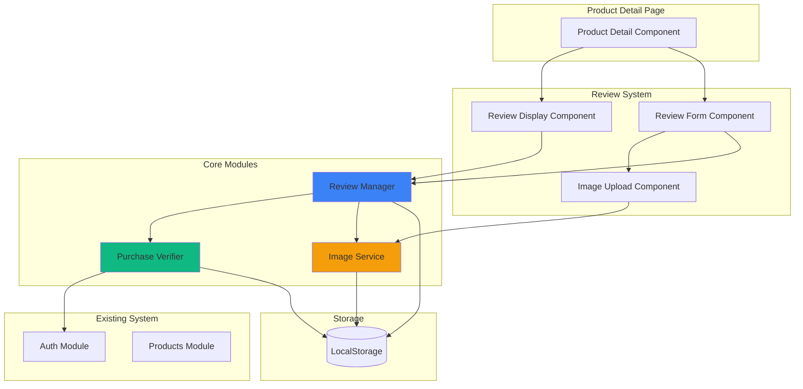
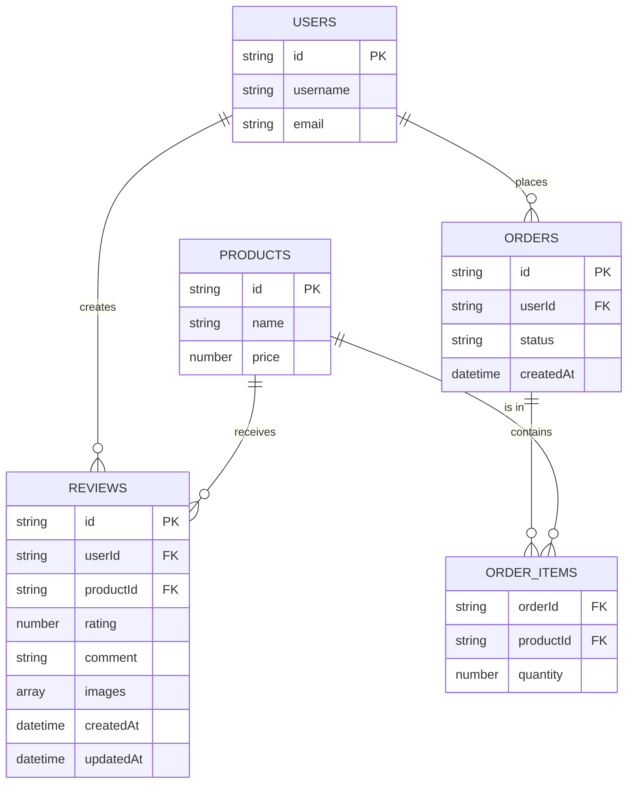

# Tài Liệu Thiết Kế - Hệ Thống Đánh Giá Sản Phẩm

## Tổng Quan

Hệ thống đánh giá sản phẩm cho phép người dùng đã mua hàng để lại đánh giá với xếp hạng sao, bình luận văn bản và ảnh minh họa. Hệ thống được xây dựng bằng Vanilla JavaScript, sử dụng LocalStorage để lưu trữ dữ liệu và tích hợp với hệ thống xác thực người dùng hiện có.

### Mục Tiêu Thiết Kế

- Tạo trải nghiệm đánh giá đơn giản, trực quan cho người dùng đã mua hàng
- Đảm bảo chỉ người mua thực sự mới có thể đánh giá sản phẩm
- Hiển thị đánh giá một cách rõ ràng, có tổ chức để hỗ trợ quyết định mua hàng
- Xử lý ảnh hiệu quả trong giới hạn của LocalStorage
- Duy trì tính toàn vẹn dữ liệu và bảo mật

### Phạm Vi

Hệ thống bao gồm:
- Module xác minh quyền đánh giá dựa trên lịch sử mua hàng
- Form nhập đánh giá với xếp hạng sao, văn bản và tải ảnh
- Component hiển thị danh sách đánh giá với thông tin người dùng
- Chức năng chỉnh sửa và xóa đánh giá của chính mình
- Tính toán và hiển thị điểm đánh giá trung bình
- Lưu trữ và quản lý dữ liệu trong LocalStorage
- Trang quản trị đánh giá cho admin với khả năng lọc, xem chi tiết và liên hệ khách hàng

## Kiến Trúc

### Kiến Trúc Tổng Thể



### Luồng Dữ Liệu

1. **Xác Minh Quyền Đánh Giá**
   - User truy cập trang chi tiết sản phẩm
   - Purchase Verifier kiểm tra trạng thái đăng nhập
   - Nếu đã đăng nhập, kiểm tra lịch sử đơn hàng trong LocalStorage
   - Hiển thị form đánh giá nếu user đã mua sản phẩm

2. **Tạo Đánh Giá**
   - User điền form: chọn sao, nhập văn bản, tải ảnh (tùy chọn)
   - Image Service chuyển đổi ảnh sang base64
   - Review Manager validate dữ liệu
   - Lưu đánh giá vào LocalStorage
   - Refresh hiển thị đánh giá

3. **Hiển Thị Đánh Giá**
   - Review Manager lấy tất cả đánh giá của sản phẩm
   - Tính toán điểm trung bình
   - Review Display Component render danh sách
   - Hiển thị badge "Đã mua hàng" cho người mua đã xác minh

4. **Chỉnh Sửa/Xóa Đánh Giá**
   - User click nút edit/delete trên đánh giá của mình
   - Review Manager xác minh quyền sở hữu
   - Thực hiện cập nhật hoặc xóa trong LocalStorage
   - Refresh hiển thị

## Các Thành Phần và Giao Diện

### 1. Review Manager Module (`shared/js/reviews.js`)

Module chính quản lý tất cả logic liên quan đến đánh giá.

```javascript
// Core functions
function createReview(reviewData)
function updateReview(reviewId, updates)
function deleteReview(reviewId)
function getReviewsByProduct(productId)
function getReviewByUserAndProduct(userId, productId)
function calculateAverageRating(productId)
function canUserReview(userId, productId)

// Vietnamese aliases
const taoDanhGia = createReview
const capNhatDanhGia = updateReview
const xoaDanhGia = deleteReview
const layDanhGiaTheoSanPham = getReviewsByProduct
const layDanhGiaTheoNguoiDungVaSanPham = getReviewByUserAndProduct
const tinhDiemTrungBinh = calculateAverageRating
const nguoiDungCoTheDanhGia = canUserReview
```

**Giao Diện:**

```typescript
interface ReviewData {
  userId: string
  productId: string
  username: string
  rating: number // 1-5
  comment: string // 10-1000 characters
  images: string[] // base64 encoded, max 3
}

interface Review extends ReviewData {
  id: string
  createdAt: string // ISO 8601
  updatedAt: string // ISO 8601
  isVerifiedPurchaser: boolean
}

interface ReviewSummary {
  averageRating: number
  totalReviews: number
  ratingDistribution: {
    5: number
    4: number
    3: number
    2: number
    1: number
  }
}
```

### 2. Purchase Verifier Module

Xác minh người dùng đã mua sản phẩm.

```javascript
function verifyPurchase(userId, productId)
function getUserCompletedOrders(userId)

// Vietnamese aliases
const xacMinhMuaHang = verifyPurchase
const layDonHangHoanThanh = getUserCompletedOrders
```

**Logic Xác Minh:**
- Lấy tất cả đơn hàng từ LocalStorage
- Lọc đơn hàng theo userId
- Kiểm tra status là "Đã giao" hoặc "Hoàn thành"
- Kiểm tra productId có trong items của đơn hàng
- Trả về true nếu tìm thấy

### 3. Image Service Module

Xử lý tải và chuyển đổi ảnh.

```javascript
function validateImageFile(file)
function convertImageToBase64(file)
function compressImage(base64String, maxSizeKB)

// Vietnamese aliases
const kiemTraFileAnh = validateImageFile
const chuyenAnhSangBase64 = convertImageToBase64
const nenAnh = compressImage
```

**Xử Lý Ảnh:**
- Validate định dạng: JPEG, PNG, GIF
- Validate kích thước: tối đa 2MB
- Chuyển đổi sang base64
- Nén ảnh nếu cần để tiết kiệm LocalStorage
- Giới hạn 3 ảnh mỗi đánh giá

### 4. Review Form Component

Component UI cho form nhập đánh giá.

```javascript
function renderReviewForm(productId, existingReview = null)
function handleReviewSubmit(event)
function handleImageUpload(event)
function removeImage(index)

// Vietnamese aliases
const hienThiFormDanhGia = renderReviewForm
const xuLyGuiDanhGia = handleReviewSubmit
const xuLyTaiAnh = handleImageUpload
const xoaAnh = removeImage
```

**Cấu Trúc HTML:**

```html
<div class="review-form-container">
  <h3>Đánh giá sản phẩm</h3>
  
  <!-- Star Rating -->
  <div class="star-rating-input">
    <label>Đánh giá của bạn:</label>
    <div class="stars">
      <span class="star" data-rating="1">★</span>
      <span class="star" data-rating="2">★</span>
      <span class="star" data-rating="3">★</span>
      <span class="star" data-rating="4">★</span>
      <span class="star" data-rating="5">★</span>
    </div>
  </div>
  
  <!-- Comment Text -->
  <div class="comment-input">
    <label>Nhận xét của bạn:</label>
    <textarea 
      id="review-comment" 
      minlength="10" 
      maxlength="1000"
      placeholder="Chia sẻ trải nghiệm của bạn về sản phẩm (tối thiểu 10 ký tự)..."
    ></textarea>
    <div class="char-count">0/1000</div>
  </div>
  
  <!-- Image Upload -->
  <div class="image-upload">
    <label>Thêm ảnh (tùy chọn, tối đa 3 ảnh):</label>
    <input 
      type="file" 
      id="review-images" 
      accept="image/jpeg,image/png,image/gif"
      multiple
    />
    <div class="image-preview"></div>
  </div>
  
  <!-- Submit Button -->
  <button type="submit" class="btn-submit-review">
    Gửi đánh giá
  </button>
</div>
```

### 5. Review Display Component

Component hiển thị danh sách đánh giá.

```javascript
function renderReviewDisplay(productId)
function renderReviewSummary(summary)
function renderReviewItem(review, currentUserId)
function renderStarRating(rating)

// Vietnamese aliases
const hienThiDanhGia = renderReviewDisplay
const hienThiTongQuan = renderReviewSummary
const hienThiMotDanhGia = renderReviewItem
const hienThiSao = renderStarRating
```

**Cấu Trúc HTML:**

```html
<div class="review-section">
  <!-- Summary -->
  <div class="review-summary">
    <div class="average-rating">
      <span class="rating-number">4.5</span>
      <div class="stars">★★★★☆</div>
      <span class="total-reviews">123 đánh giá</span>
    </div>
    <div class="rating-distribution">
      <div class="rating-bar">
        <span>5★</span>
        <div class="bar"><div class="fill" style="width: 60%"></div></div>
        <span>75</span>
      </div>
      <!-- Repeat for 4, 3, 2, 1 stars -->
    </div>
  </div>
  
  <!-- Review List -->
  <div class="review-list">
    <div class="review-item">
      <div class="review-header">
        <div class="user-info">
          <span class="username">nguyenvana</span>
          <span class="verified-badge">✓ Đã mua hàng</span>
        </div>
        <div class="review-actions">
          <button class="btn-edit">Sửa</button>
          <button class="btn-delete">Xóa</button>
        </div>
      </div>
      <div class="review-rating">★★★★★</div>
      <div class="review-comment">
        Sản phẩm rất tốt, gió mạnh, tiết kiệm điện...
      </div>
      <div class="review-images">
        
      </div>
      <div class="review-date">15/01/2026</div>
    </div>
  </div>
</div>
```

### 6. Admin Review Management Page

Trang quản trị để admin xem và quản lý tất cả đánh giá.

```javascript
function renderAdminReviewsPage()
function filterReviewsByRating(rating)
function viewReviewDetails(reviewId)
function contactCustomer(reviewId)
function deleteReviewAsAdmin(reviewId)
function calculateReviewStatistics()

// Vietnamese aliases
const hienThiTrangQuanTriDanhGia = renderAdminReviewsPage
const locDanhGiaTheoSao = filterReviewsByRating
const xemChiTietDanhGia = viewReviewDetails
const lienHeKhachHang = contactCustomer
const xoaDanhGiaQuanTri = deleteReviewAsAdmin
const tinhThongKeDanhGia = calculateReviewStatistics
```

**Cấu Trúc HTML:**

```html
<div class="admin-reviews-page">
  <!-- Statistics Summary -->
  <div class="review-stats">
    <div class="stat-card">
      <h3>Tổng đánh giá</h3>
      <p class="stat-number">245</p>
    </div>
    <div class="stat-card">
      <h3>Điểm trung bình</h3>
      <p class="stat-number">4.2 ★</p>
    </div>
    <div class="stat-card warning">
      <h3>Đánh giá xấu (≤2★)</h3>
      <p class="stat-number">12 (4.9%)</p>
    </div>
  </div>
  
  <!-- Filter Buttons -->
  <div class="review-filters">
    <button class="filter-btn active" data-rating="all">Tất cả</button>
    <button class="filter-btn" data-rating="5">5★</button>
    <button class="filter-btn" data-rating="4">4★</button>
    <button class="filter-btn" data-rating="3">3★</button>
    <button class="filter-btn" data-rating="2">2★</button>
    <button class="filter-btn" data-rating="1">1★</button>
  </div>
  
  <!-- Reviews Table -->
  <table class="admin-table">
    <thead>
      <tr>
        <th>Sản phẩm</th>
        <th>Người dùng</th>
        <th>Đánh giá</th>
        <th>Nhận xét</th>
        <th>Ngày</th>
        <th>Thao tác</th>
      </tr>
    </thead>
    <tbody>
      <tr class="negative-review">
        <td>Quạt điện Panasonic</td>
        <td>nguyenvana</td>
        <td>★★☆☆☆</td>
        <td>Sản phẩm không tốt như mô tả...</td>
        <td>25/01/2026</td>
        <td>
          <button class="btn-view" onclick="viewReviewDetails('review_id')">
            👁️ Xem
          </button>
          <button class="btn-delete" onclick="deleteReviewAsAdmin('review_id')">
            🗑️ Xóa
          </button>
        </td>
      </tr>
    </tbody>
  </table>
</div>

<!-- Review Detail Modal -->
<div id="review-detail-modal" class="modal">
  <div class="modal-content">
    <div class="modal-header">
      <h3>Chi tiết đánh giá</h3>
      <button class="close-btn">&times;</button>
    </div>
    <div class="modal-body">
      <div class="review-detail">
        <h4>Thông tin sản phẩm</h4>
        <p><strong>Tên:</strong> Quạt điện Panasonic</p>
        
        <h4>Thông tin khách hàng</h4>
        <p><strong>Tên:</strong> Nguyễn Văn A</p>
        <p><strong>Email:</strong> nguyenvana@email.com</p>
        <p><strong>Số đơn hàng đã mua:</strong> 5</p>
        
        <h4>Đánh giá</h4>
        <p><strong>Số sao:</strong> ★★☆☆☆ (2/5)</p>
        <p><strong>Nhận xét:</strong></p>
        <p class="review-comment-full">
          Sản phẩm không tốt như mô tả. Gió yếu, tiếng ồn lớn...
        </p>
        
        <div class="review-images-full">
          
        </div>
        
        <p><strong>Ngày tạo:</strong> 25/01/2026 10:30</p>
        <p><strong>Cập nhật:</strong> 25/01/2026 10:30</p>
      </div>
    </div>
    <div class="modal-footer">
      <button class="btn btn-contact" onclick="contactCustomer('review_id')">
        📧 Liên hệ khách hàng
      </button>
      <button class="btn btn-delete" onclick="deleteReviewAsAdmin('review_id')">
        🗑️ Xóa đánh giá
      </button>
    </div>
  </div>
</div>

<!-- Contact Customer Modal -->
<div id="contact-modal" class="modal">
  <div class="modal-content">
    <div class="modal-header">
      <h3>Liên hệ khách hàng</h3>
      <button class="close-btn">&times;</button>
    </div>
    <div class="modal-body">
      <div class="contact-info">
        <p><strong>Email khách hàng:</strong></p>
        <div class="email-copy">
          <input type="text" value="nguyenvana@email.com" readonly />
          <button class="btn-copy" onclick="copyEmail()">📋 Copy</button>
        </div>
        
        <p><strong>Mẫu email gợi ý:</strong></p>
        <div class="email-template">
          <p><strong>Tiêu đề:</strong> Phản hồi đánh giá sản phẩm Quạt điện Panasonic</p>
          <p><strong>Nội dung:</strong></p>
          <textarea readonly>
Kính gửi Nguyễn Văn A,

Cảm ơn bạn đã chia sẻ đánh giá về sản phẩm Quạt điện Panasonic.

Chúng tôi rất tiếc khi biết bạn không hài lòng với sản phẩm (đánh giá 2/5 sao). 
Nhận xét của bạn: "Sản phẩm không tốt như mô tả. Gió yếu, tiếng ồn lớn..."

Chúng tôi muốn hiểu rõ hơn về vấn đề và tìm cách giải quyết. 
Vui lòng liên hệ lại để chúng tôi hỗ trợ bạn tốt nhất.

Trân trọng,
Fan Shop Team
          </textarea>
        </div>
      </div>
    </div>
    <div class="modal-footer">
      <button class="btn" onclick="closeContactModal()">Đóng</button>
    </div>
  </div>
</div>
```

**Admin Functions:**

```javascript
/**
 * Get all reviews with product and user info
 */
function getAllReviewsWithDetails() {
  const reviews = JSON.parse(localStorage.getItem('reviews')) || [];
  const products = getAllProducts();
  const users = JSON.parse(localStorage.getItem('users')) || [];
  
  return reviews.map(review => {
    const product = products.find(p => p.id === review.productId);
    const user = users.find(u => u.id === review.userId);
    
    return {
      ...review,
      productName: product ? product.name : 'Unknown',
      userEmail: user ? user.email : 'Unknown'
    };
  });
}

/**
 * Filter reviews by rating
 */
function filterReviewsByRating(rating) {
  const allReviews = getAllReviewsWithDetails();
  
  if (rating === 'all') {
    return allReviews;
  }
  
  return allReviews.filter(review => review.rating === parseInt(rating));
}

/**
 * Get negative reviews (rating <= 2)
 */
function getNegativeReviews() {
  const allReviews = getAllReviewsWithDetails();
  return allReviews.filter(review => review.rating <= 2);
}

/**
 * Calculate review statistics
 */
function calculateReviewStatistics() {
  const reviews = JSON.parse(localStorage.getItem('reviews')) || [];
  
  const stats = {
    total: reviews.length,
    averageRating: 0,
    distribution: { 5: 0, 4: 0, 3: 0, 2: 0, 1: 0 },
    negativeCount: 0,
    negativePercentage: 0
  };
  
  if (reviews.length === 0) return stats;
  
  let totalRating = 0;
  reviews.forEach(review => {
    totalRating += review.rating;
    stats.distribution[review.rating]++;
    if (review.rating <= 2) {
      stats.negativeCount++;
    }
  });
  
  stats.averageRating = (totalRating / reviews.length).toFixed(1);
  stats.negativePercentage = ((stats.negativeCount / reviews.length) * 100).toFixed(1);
  
  return stats;
}

/**
 * Get user's order history
 */
function getUserOrderHistory(userId) {
  const orders = JSON.parse(localStorage.getItem('orders')) || [];
  return orders.filter(order => order.userId === userId);
}

/**
 * Log contact attempt
 */
function logContactAttempt(reviewId) {
  const reviews = JSON.parse(localStorage.getItem('reviews')) || [];
  const review = reviews.find(r => r.id === reviewId);
  
  if (review) {
    if (!review.contactLog) {
      review.contactLog = [];
    }
    
    review.contactLog.push({
      timestamp: new Date().toISOString(),
      admin: getCurrentUser().username
    });
    
    localStorage.setItem('reviews', JSON.stringify(reviews));
  }
}
```

### 7. Contact Management Module

Module quản lý lịch sử liên hệ với khách hàng.

```javascript
function createContact(contactData)
function updateContactStatus(contactId, newStatus)
function addContactNote(contactId, noteText)
function getContactsByStatus(status)
function getAllContacts()
function exportContactsToExcel(contacts)

// Vietnamese aliases
const taoLienHe = createContact
const capNhatTrangThaiLienHe = updateContactStatus
const themGhiChuLienHe = addContactNote
const layLienHeTheoTrangThai = getContactsByStatus
const layTatCaLienHe = getAllContacts
const xuatExcelLienHe = exportContactsToExcel
```

**Giao Diện:**

```typescript
interface ContactData {
  reviewId: string
  customerId: string
  customerName: string
  customerEmail: string
  productName: string
  reviewRating: number
  contactReason: string
}

interface Contact extends ContactData {
  id: string
  contactDate: string // ISO 8601
  adminUsername: string
  notes: ContactNote[]
  status: 'Chờ xử lý' | 'Đã liên hệ' | 'Đã giải quyết'
  statusHistory: StatusChange[]
}

interface ContactNote {
  text: string
  timestamp: string // ISO 8601
  adminUsername: string
}

interface StatusChange {
  from: string
  to: string
  timestamp: string // ISO 8601
  adminUsername: string
}
```

**Contact Management Functions:**

```javascript
/**
 * Create a new contact record
 */
function createContact(contactData) {
  const contacts = JSON.parse(localStorage.getItem('contacts')) || [];
  const currentUser = getCurrentUser();
  
  const contact = {
    id: `contact_${Date.now()}_${Math.random().toString(36).substr(2, 9)}`,
    ...contactData,
    contactDate: new Date().toISOString(),
    adminUsername: currentUser.username,
    notes: [],
    status: 'Chờ xử lý',
    statusHistory: [{
      from: null,
      to: 'Chờ xử lý',
      timestamp: new Date().toISOString(),
      adminUsername: currentUser.username
    }]
  };
  
  contacts.push(contact);
  localStorage.setItem('contacts', JSON.stringify(contacts));
  
  return contact;
}

/**
 * Update contact status
 */
function updateContactStatus(contactId, newStatus) {
  const contacts = JSON.parse(localStorage.getItem('contacts')) || [];
  const contact = contacts.find(c => c.id === contactId);
  const currentUser = getCurrentUser();
  
  if (contact) {
    const oldStatus = contact.status;
    contact.status = newStatus;
    contact.statusHistory.push({
      from: oldStatus,
      to: newStatus,
      timestamp: new Date().toISOString(),
      adminUsername: currentUser.username
    });
    
    localStorage.setItem('contacts', JSON.stringify(contacts));
  }
  
  return contact;
}

/**
 * Add note to contact
 */
function addContactNote(contactId, noteText) {
  const contacts = JSON.parse(localStorage.getItem('contacts')) || [];
  const contact = contacts.find(c => c.id === contactId);
  const currentUser = getCurrentUser();
  
  if (contact) {
    contact.notes.push({
      text: noteText,
      timestamp: new Date().toISOString(),
      adminUsername: currentUser.username
    });
    
    localStorage.setItem('contacts', JSON.stringify(contacts));
  }
  
  return contact;
}

/**
 * Export contacts to Excel using SheetJS
 */
function exportContactsToExcel(contacts) {
  // Prepare data for Excel
  const excelData = contacts.map(contact => ({
    'Ngày liên hệ': new Date(contact.contactDate).toLocaleDateString('vi-VN'),
    'Khách hàng': contact.customerName,
    'Email': contact.customerEmail,
    'Sản phẩm': contact.productName,
    'Đánh giá': `${contact.reviewRating}★`,
    'Lý do liên hệ': contact.contactReason,
    'Trạng thái': contact.status,
    'Ghi chú': contact.notes.map(n => n.text).join('; '),
    'Admin xử lý': contact.adminUsername
  }));
  
  // Create workbook and worksheet
  const wb = XLSX.utils.book_new();
  const ws = XLSX.utils.json_to_sheet(excelData);
  
  // Add worksheet to workbook
  XLSX.utils.book_append_sheet(wb, ws, 'Liên hệ khách hàng');
  
  // Generate filename with current date
  const date = new Date().toISOString().split('T')[0];
  const filename = `lien-he-khach-hang-${date}.xlsx`;
  
  // Download file
  XLSX.writeFile(wb, filename);
}
```

## Mô Hình Dữ Liệu

### LocalStorage Structure

**Key: `reviews`**

```json
[
  {
    "id": "1737800000000_abc123xyz",
    "userId": "user_1_1737800000000",
    "productId": "product_1_1737800000000",
    "username": "nguyenvana",
    "rating": 5,
    "comment": "Sản phẩm rất tốt, gió mạnh, tiết kiệm điện. Tôi rất hài lòng với chất lượng.",
    "images": [
      "data:image/jpeg;base64,/9j/4AAQSkZJRg...",
      "data:image/jpeg;base64,/9j/4AAQSkZJRg..."
    ],
    "createdAt": "2026-01-25T10:30:00.000Z",
    "updatedAt": "2026-01-25T10:30:00.000Z",
    "isVerifiedPurchaser": true,
    "contactLog": [
      {
        "timestamp": "2026-01-26T14:20:00.000Z",
        "admin": "admin"
      }
    ]
  }
]
```

**Key: `contacts`**

```json
[
  {
    "id": "contact_1737800000000_xyz789abc",
    "reviewId": "1737800000000_abc123xyz",
    "customerId": "user_1_1737800000000",
    "customerName": "Nguyễn Văn A",
    "customerEmail": "nguyenvana@email.com",
    "productName": "Quạt điện Panasonic",
    "reviewRating": 2,
    "contactReason": "Đánh giá xấu - Khách hàng không hài lòng",
    "contactDate": "2026-01-26T14:20:00.000Z",
    "adminUsername": "admin",
    "notes": [
      {
        "text": "Đã gọi điện cho khách hàng, khách phản ánh sản phẩm gió yếu",
        "timestamp": "2026-01-26T15:30:00.000Z",
        "adminUsername": "admin"
      },
      {
        "text": "Đã đổi sản phẩm mới cho khách hàng",
        "timestamp": "2026-01-27T10:00:00.000Z",
        "adminUsername": "admin"
      }
    ],
    "status": "Đã giải quyết",
    "statusHistory": [
      {
        "from": null,
        "to": "Chờ xử lý",
        "timestamp": "2026-01-26T14:20:00.000Z",
        "adminUsername": "admin"
      },
      {
        "from": "Chờ xử lý",
        "to": "Đã liên hệ",
        "timestamp": "2026-01-26T15:30:00.000Z",
        "adminUsername": "admin"
      },
      {
        "from": "Đã liên hệ",
        "to": "Đã giải quyết",
        "timestamp": "2026-01-27T10:00:00.000Z",
        "adminUsername": "admin"
      }
    ]
  }
]
```

### Quan Hệ Dữ Liệu



### Validation Rules

**Review Object:**
- `id`: Required, unique, format: `{timestamp}_{random}`
- `userId`: Required, must exist in users
- `productId`: Required, must exist in products
- `username`: Required, non-empty string
- `rating`: Required, integer 1-5
- `comment`: Required, string 10-1000 characters
- `images`: Optional, array of base64 strings, max 3 items
- `createdAt`: Required, ISO 8601 datetime
- `updatedAt`: Required, ISO 8601 datetime
- `isVerifiedPurchaser`: Required, boolean

**Image File:**
- Format: JPEG, PNG, or GIF
- Size: Maximum 2MB per file
- Count: Maximum 3 images per review

**Purchase Verification:**
- Order must exist with userId
- Order status must be "Đã giao" or "Hoàn thành"
- Order items must contain productId


## Tính Chất Đúng Đắn (Correctness Properties)

*Tính chất (property) là một đặc điểm hoặc hành vi phải đúng trong mọi trường hợp thực thi hợp lệ của hệ thống - về cơ bản là một phát biểu chính thức về những gì hệ thống nên làm. Các tính chất đóng vai trò là cầu nối giữa đặc tả có thể đọc được bởi con người và các đảm bảo tính đúng đắn có thể xác minh được bởi máy.*

### Property 1: Purchase Verification Correctness

*For any* user, product, and set of orders, the purchase verification function SHALL return true if and only if there exists an order with the user's ID containing the product ID and having status "Đã giao" or "Hoàn thành".

**Validates: Requirements 1.1, 1.2, 1.3**

### Property 2: Comment Length Validation

*For any* string input as a review comment, the validation function SHALL accept the input if and only if its length is between 10 and 1000 characters inclusive.

**Validates: Requirements 2.1**

### Property 3: Review Storage Round-Trip

*For any* valid review object, storing it to the review system and then retrieving it SHALL produce a review object with all fields (id, userId, productId, username, rating, comment, images, createdAt, updatedAt) preserved with identical values.

**Validates: Requirements 2.2, 3.3, 8.2**

### Property 4: XSS Sanitization

*For any* string containing HTML tags or JavaScript code, the sanitization function SHALL remove or escape all potentially dangerous content (script tags, event handlers, iframes) while preserving safe text content.

**Validates: Requirements 2.3**

### Property 5: Average Rating Calculation

*For any* non-empty set of reviews with ratings, the calculated average rating SHALL equal the sum of all rating values divided by the count of reviews, rounded to one decimal place.

**Validates: Requirements 3.4**

### Property 6: Review Sorting by Timestamp

*For any* set of reviews for a product, when retrieved by the system, they SHALL be ordered in descending order by their createdAt timestamp (newest first).

**Validates: Requirements 5.1**

### Property 7: Update Preserves Identity

*For any* existing review, when updated with new data, the updated review SHALL maintain the same id value and SHALL have an updatedAt timestamp that is greater than or equal to the original updatedAt timestamp.

**Validates: Requirements 6.3**

### Property 8: Deletion Removes Only Target

*For any* set of reviews, when one review is deleted by its ID, the deletion SHALL remove only that specific review and SHALL leave all other reviews unchanged in the storage.

**Validates: Requirements 6.5**

### Property 9: Duplicate Detection

*For any* user and product combination, if a review already exists with that userId and productId, the system SHALL detect the duplicate and SHALL reject any attempt to create a new review with the same userId and productId combination.

**Validates: Requirements 7.2, 7.3**

### Property 10: Unique ID Generation

*For any* sequence of ID generation calls, each generated ID SHALL be unique and SHALL not match any previously generated ID in the same session.

**Validates: Requirements 8.3**

### Property 11: Validation Rejects Invalid Data

*For any* review data object, the validation function SHALL reject the data if any of the following conditions are true: rating is not an integer between 1-5, comment length is not between 10-1000 characters, images array contains more than 3 items, or any required field (userId, productId, username, rating, comment) is missing or empty.

**Validates: Requirements 3.2, 4.4, 8.4**

## Xử Lý Lỗi

### Validation Errors

**Comment Validation:**
- Empty or whitespace-only: "Vui lòng nhập nhận xét"
- Too short (<10 chars): "Nhận xét phải có ít nhất 10 ký tự"
- Too long (>1000 chars): "Nhận xét không được vượt quá 1000 ký tự"

**Rating Validation:**
- Not selected: "Vui lòng chọn số sao đánh giá"
- Invalid value: "Đánh giá phải từ 1 đến 5 sao"

**Image Validation:**
- Invalid format: "Chỉ chấp nhận file ảnh định dạng JPEG, PNG, GIF"
- File too large: "Kích thước ảnh không được vượt quá 2MB"
- Too many images: "Chỉ được tải lên tối đa 3 ảnh"

**Purchase Verification:**
- Not logged in: "Vui lòng đăng nhập để đánh giá sản phẩm"
- Not purchased: "Chỉ người đã mua sản phẩm mới có thể đánh giá"
- Already reviewed: "Bạn đã đánh giá sản phẩm này rồi. Bạn có thể chỉnh sửa đánh giá của mình."

### Storage Errors

**LocalStorage Full:**
- Error: "Không thể lưu đánh giá. Bộ nhớ đã đầy."
- Action: Suggest user to delete old data or reduce image count

**Data Corruption:**
- Error: "Dữ liệu đánh giá bị lỗi. Vui lòng thử lại."
- Action: Log error, attempt to recover or reset reviews data

### Network/System Errors

**Image Processing:**
- Error: "Không thể xử lý ảnh. Vui lòng thử ảnh khác."
- Action: Allow user to remove failed image and try another

**Concurrent Modifications:**
- Error: "Đánh giá đã được cập nhật bởi người khác. Vui lòng tải lại trang."
- Action: Refresh page to get latest data

### Error Handling Strategy

```javascript
function handleReviewError(error, context) {
  // Log error for debugging
  console.error(`Review Error [${context}]:`, error);
  
  // Determine error type and user message
  let userMessage = 'Đã xảy ra lỗi. Vui lòng thử lại.';
  
  if (error.type === 'VALIDATION_ERROR') {
    userMessage = error.message;
  } else if (error.type === 'STORAGE_ERROR') {
    userMessage = 'Không thể lưu dữ liệu. Vui lòng kiểm tra bộ nhớ.';
  } else if (error.type === 'PERMISSION_ERROR') {
    userMessage = error.message;
  }
  
  // Display error to user
  hienThiThongBao(userMessage, 'error');
  
  // Return error info for further handling
  return {
    handled: true,
    userMessage: userMessage,
    originalError: error
  };
}
```

## Chiến Lược Kiểm Thử

### Dual Testing Approach

Hệ thống sử dụng kết hợp hai phương pháp kiểm thử:

1. **Unit Tests (Example-Based)**: Kiểm tra các trường hợp cụ thể, edge cases, và tương tác UI
2. **Property-Based Tests**: Xác minh các tính chất phổ quát trên nhiều đầu vào ngẫu nhiên

### Property-Based Testing

**Library**: fast-check (JavaScript property-based testing library)

**Configuration**:
- Minimum 100 iterations per property test
- Each test references its design document property
- Tag format: `Feature: product-review-system, Property {number}: {property_text}`

**Property Test Implementation**:

```javascript
// Example: Property 3 - Review Storage Round-Trip
describe('Feature: product-review-system, Property 3: Review storage round-trip', () => {
  it('should preserve all fields when storing and retrieving reviews', () => {
    fc.assert(
      fc.property(
        fc.record({
          userId: fc.string({ minLength: 1 }),
          productId: fc.string({ minLength: 1 }),
          username: fc.string({ minLength: 1 }),
          rating: fc.integer({ min: 1, max: 5 }),
          comment: fc.string({ minLength: 10, maxLength: 1000 }),
          images: fc.array(fc.string(), { maxLength: 3 })
        }),
        (reviewData) => {
          // Store review
          const review = createReview(reviewData);
          
          // Retrieve review
          const retrieved = getReviewByUserAndProduct(
            reviewData.userId,
            reviewData.productId
          );
          
          // Verify all fields preserved
          expect(retrieved.userId).toBe(reviewData.userId);
          expect(retrieved.productId).toBe(reviewData.productId);
          expect(retrieved.username).toBe(reviewData.username);
          expect(retrieved.rating).toBe(reviewData.rating);
          expect(retrieved.comment).toBe(reviewData.comment);
          expect(retrieved.images).toEqual(reviewData.images);
          expect(retrieved.id).toBeDefined();
          expect(retrieved.createdAt).toBeDefined();
          expect(retrieved.updatedAt).toBeDefined();
        }
      ),
      { numRuns: 100 }
    );
  });
});
```

### Unit Testing Strategy

**Test Categories**:

1. **Validation Tests**
   - Comment length boundaries (9, 10, 1000, 1001 chars)
   - Rating values (0, 1, 5, 6)
   - Image count (0, 1, 3, 4)
   - Required fields presence

2. **UI Interaction Tests**
   - Form rendering for verified/non-verified users
   - Star rating selection
   - Image upload and preview
   - Edit/delete button visibility
   - Success/error message display

3. **Integration Tests**
   - Complete review submission flow
   - Edit existing review flow
   - Delete review with confirmation
   - Image upload and base64 conversion
   - LocalStorage read/write operations

4. **Edge Cases**
   - Empty review list display
   - Single review display
   - Maximum images (3) handling
   - Very long comments (near 1000 chars)
   - Special characters in comments
   - Multiple reviews by different users

**Test Data**:
- Use sample users, products, and orders from existing system
- Generate edge case data (empty strings, max lengths, special chars)
- Mock LocalStorage for isolated testing

### Testing Tools

- **Test Framework**: Jest or Mocha
- **Assertion Library**: Chai or Jest expect
- **Property Testing**: fast-check
- **DOM Testing**: jsdom or Testing Library
- **Coverage Tool**: Istanbul/nyc

### Coverage Goals

- **Line Coverage**: Minimum 80%
- **Branch Coverage**: Minimum 75%
- **Function Coverage**: Minimum 90%
- **Property Tests**: All 11 properties implemented
- **Critical Paths**: 100% coverage for validation, storage, and purchase verification

### Test Execution

```bash
# Run all tests
npm test

# Run property tests only
npm test -- --grep "Property"

# Run with coverage
npm test -- --coverage

# Run specific test file
npm test reviews.test.js
```

### Continuous Testing

- Run tests on every commit (pre-commit hook)
- Run full test suite in CI/CD pipeline
- Monitor test execution time (target: <30 seconds)
- Fail build on test failures or coverage drops
